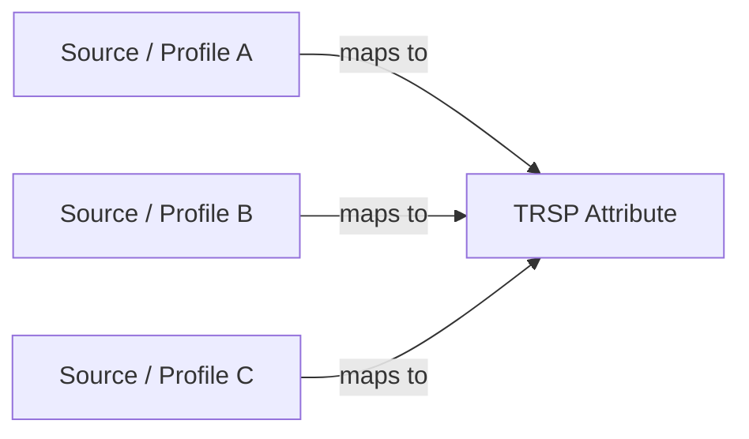
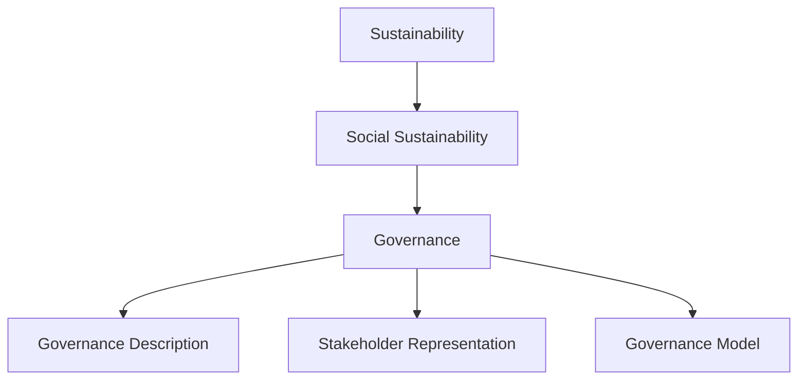
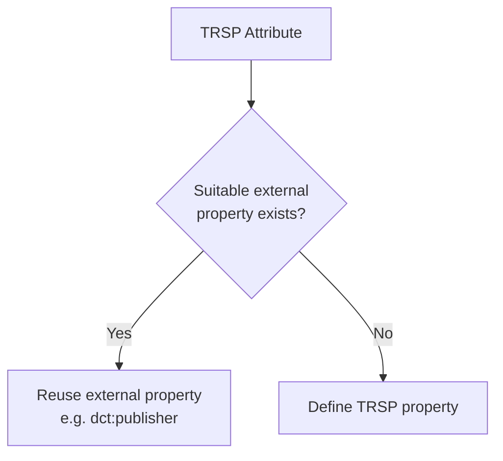
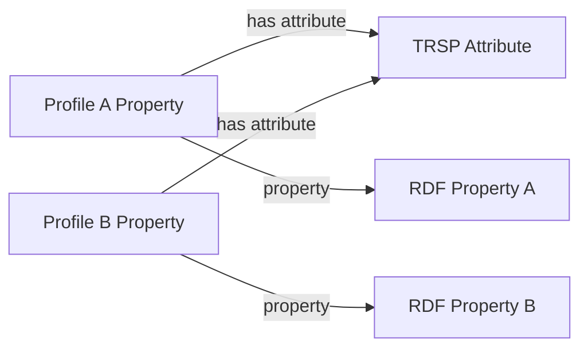
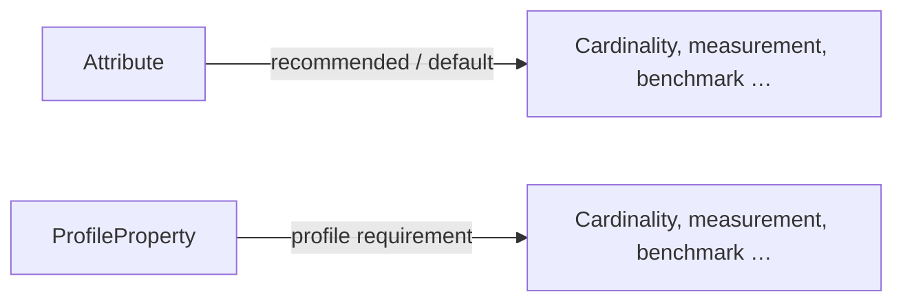
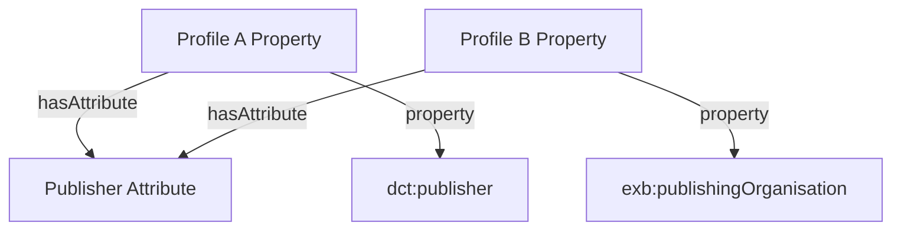
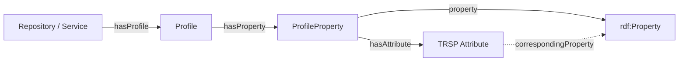

# Modelling Attributes in TRSP

## Purpose

The RDA TRSP WG Attribute model provides a neutral, consolidated vocabulary of characteristics that can be used to describe repositories and repository services. It sits conceptually before the Profile model: **Attributes identify what characteristic is being described; Profiles specify how a particular source, schema, community, or application represents that characteristic.**

The Attribute inventory originates in the RDA TRSP Working Group's categorisation and mapping of repository and service attributes and has subsequently been refined in EOSC EDEN with additional mappings, profiles, vocabularies, checklists, and attributes derived from related work such as FIDELIS TTRAM.

This chapter explains the Attribute model first for repository and service managers and curators, and then provides encoding guidance for developers and data scientists. Detailed definitions of constraint-related properties such as cardinality, measurement type, benchmarks, and algorithms are intentionally deferred to a separate chapter.


## Provenance and foundational inputs

The work documented in this guide builds on two sets of foundational inputs that are at a higher level of maturity:

1. The work done to date by the RDA TRSP Working Group. The TRSP WG has, as its main objective, to recommend a set of repository and service attributes that can be used to describe and assess the suitability or performance of services to trustworthy repositories and software packages used by such repositories. The major resource developed by the working group in this process is a categorisation and mapping of a large number of repository attributes. The result is an inventory of repository attributes that can be used as a central point of comparison between sources of such attributes. The sources that were considered in the compilation of the inventory include, inter alia, TRUST, CARE, and FAIR principles, CoreTrustSeal criteria, Criteria that Matter, re3data, FAIRSHaring, schema.org, and aspects of repository performance published by the Digital Preservation Council. The inventory and the supporting materials are in the process of being published formally [18].
2. The work done by EOSC EDEN. In support of the EDEN Registry implementation, WP2 in EOSC EDEN further refined the TRSP attributes in a number of ways:
2.1 Schema definition: an RDF schema, based on SKOS TTL, is in development and initial iterations are available. 
2.2 Additional Mappings and Profiles: The EDEN project compiled additional mappings resulting in new profiles of the TRSP attributes, including a mapping of the CPP developed by EDEN WP1, a mapping of the repository and service attributes identified in EDEN WP2, and a mapping of the attributes implied in the TTRAM developed in EOSC FIDELIS. It also mapped and integrated the re3data schema more comprehensively than was done in the TRSP work.
2.3 Vocabularies and Checklists: definition ofadditional placeholder vocabularies and checklists.
3. Attribute Knowledge Base: The attributes knowledge base is being created as a GitHub repository, supported by automated curation tools, for future curation by a maintenance successor of the TRSP Working Group in RDA. This appears to be the most flexible arrangement available, since any interested party can submit changes via pull requests to the curator group, and in principle, any interested party would be able to become one of the curator group by joining the RDA Maintenance Group. 
4. We have also added implied attributes from the FIDELIS TTRAM work, and FIDELIS has elaboared a set of attributes it considers to be mandatory for each repository that joins the FIDELIS Network.

More elaborate descriptions of governance options will be added later.

---

# Part I — Conceptual Guide for Repository and Service Managers

## 1. Why TRSP Attributes exist

Repositories and services are described by many standards, registries, assessment frameworks, principles, schemas, and community-specific models. These sources frequently describe the same underlying characteristic in different ways.

For example, several sources may contain fields or criteria concerned with a repository's publisher, governance, preservation policy, community engagement, or sustainability. The source terms may have different names, definitions, structures, and technical encodings even when they address substantially the same characteristic.

TRSP therefore maintains a consolidated **Attribute vocabulary** that provides a neutral point of reference across these sources.



The Attribute is not intended to replace the original source term. It provides a common semantic pivot that makes the different representations easier to compare and map.

## 2. Attributes form a hierarchical concept scheme

TRSP Attributes are organised as SKOS concepts in a hierarchy. Broad concepts provide thematic organisation, while more specific concepts identify characteristics that can be represented in repository or service data.

For example, the Attribute vocabulary contains a hierarchy broadly of the form:

```text
Sustainability
└── Social Sustainability
    ├── Governance
    │   ├── Governance Description
    │   ├── Stakeholder Representation
    │   └── Governance Model
    ├── Expert Guidance
    │   └── Periodic Expert / External Review
    ├── Living Will
    │   └── Public Statement of Wind-Down
    └── Community Engagement
```

The hierarchy is expressed using `skos:broader` rather than OWL subclass relationships because these are **conceptual characteristics**, not classes of repositories or services.



## 3. Attributes are neutral concepts, not instance-data predicates

An Attribute identifies a characteristic such as **Publisher**, **Governance Model**, or **Community Engagement**. It is not necessarily the RDF property used to encode that characteristic in actual repository data.

This distinction allows TRSP to reuse established properties wherever suitable.

For example:

```text
TRSP Attribute: Publisher
          │
          └── corresponding property ──→ dct:publisher
```

Repository data can then continue to use the established property:

```turtle
ex:Repository123
    dct:publisher ex:Organisation456 .
```

The TRSP Attribute provides the neutral semantic reference; `dct:publisher` remains the interoperable RDF predicate.

## 4. TRSP properties are defined only where necessary

Not every Attribute has a suitable property in an established external vocabulary. Where a sufficiently appropriate property exists — for example `dct:publisher` — TRSP should reuse it.

Where no suitable external property exists, TRSP can define its own RDF property and map the Attribute to that property.



This approach avoids unnecessary duplication while still allowing TRSP to represent characteristics that are absent from established vocabularies.

## 5. Attributes provide the pivot between Profiles

The Attribute model and Profile model solve different problems:

- an **Attribute** identifies the characteristic being discussed;
- a **ProfileProperty** describes how a particular profile represents that characteristic;
- an **RDF property** is the predicate actually used in encoded instance data.

This allows properties from different profiles to converge on the same Attribute even when they use different RDF predicates or structures.



The Attribute therefore acts as a **neutral mapping link**. Pairwise mappings between every possible pair of source profiles are not required simply to establish that they describe the same underlying characteristic.

## 6. Attribute recommendations versus Profile requirements

Attributes can carry information resembling constraints, including:

- cardinality;
- measurement type;
- benchmark or expected-value information;
- value or class expectations;
- algorithm-related information.

At the **Attribute level**, these values should normally be interpreted as **recommendations, defaults, or best-practice guidance** derived from the consolidated knowledge base. They do not by themselves make a repository description invalid.

At the **ProfileProperty level**, equivalent information describes how a particular profile actually uses the property and can therefore represent a hard requirement of that profile.



This distinction is important. The Attribute knowledge base can recommend that a characteristic normally occurs once, and SHOULD use values from a specific vocabulary or conform to a type, while an external schema or assessment profile can legitimately require a different cardinality and require that values MUST come from a specific vocabulary.

The detailed semantics and encoding of these constraint-related properties are covered separately.

## 7. How the Attribute and Profile chapters fit together

The complete conceptual chain is:

```text
Source knowledge
      │
      ▼
TRSP Attribute vocabulary
      │
      │ neutral semantic reference
      ▼
ProfileProperty
      │
      │ actual encoding predicate
      ▼
rdf:Property
      │
      ▼
Repository / Service instance data
```

In practice, a ProfileProperty normally connects both to the relevant Attribute and to the RDF property used by that profile. 

Profiles, Properties, and their relation to Repositories and Services are discussed in the next chapter.

---

# Part II — Encoding Guidance for Developers and Data Scientists

## 8. Attribute vocabulary as SKOS

The Attribute inventory is a SKOS Concept Scheme:

```turtle
trsp:trsp-attributes
    a skos:ConceptScheme ;
    dct:title "TRSP Attribute Definition Vocabulary"@en ;
    skos:prefLabel "TRSP Attributes"@en .
```

Individual Attributes are concepts within the scheme and are connected hierarchically using `skos:broader`.

### Explicit `trsp:Attribute` typing

 `trsp:Attribute` is modelled as a subclass of skos:Concept in the TRSP ontology:

```turtle
trsp:Attribute
    a owl:Class ;
    rdfs:subClassOf skos:Concept ;
    rdfs:label "Attribute"@en ;
    skos:definition "A consolidated characteristic of a repository or service used as a neutral semantic reference for mapping and comparison."@en .
```

A minimal encoding is then:

```turtle
trsp:att.539A68DF8A
    a trsp:Attribute ;
    skos:prefLabel "Governance"@en ;
    skos:definition "The structures, authority, decision processes and accountability arrangements by which an organisation or service is directed and controlled."@en ;
    skos:broader trsp:att.0849A7F1E2 ;
    skos:inScheme trsp:trsp-attributes .
```

Because `trsp:Attribute` is a subclass of `skos:Concept`, explicit dual typing as both `trsp:Attribute` and `skos:Concept` is not necessary for inference-aware consumers, although it may be retained in serializations for convenience if desired.

## 9. Do not confuse an Attribute with its RDF property

The Attribute and the RDF predicate should have different IRIs and different roles.

```text
trsp:att.XXXXXXXXXX       = concept identifying a characteristic

dct:publisher            = RDF predicate used to encode a value
```

An Attribute should therefore not itself be declared as an `rdf:Property` merely because it can be mapped to one.

## 10. Mapping an Attribute to an RDF property

A dedicated mapping property identifies one or more RDF predicates that represents the Attribute.

For example:

```turtle
trsp:correspondingProperty
    a owl:ObjectProperty ;
    rdfs:domain trsp:Attribute ;
    rdfs:range rdf:Property ;
    rdfs:label "corresponding property"@en ;
    skos:definition "Relates a TRSP Attribute to an RDF property that can be used to represent that characteristic in encoded data."@en .
```

An Attribute with an established external representation could then be encoded as:

```turtle
trsp:att.XXXXXXXX
    a trsp:Attribute ;
    skos:prefLabel "Publisher"@en ;
    trsp:correspondingProperty dct:publisher ;
    skos:inScheme trsp:trsp-attributes .
```

This does **not** assert that the Attribute and property are the same RDF resource. It records that the property is an encoding of the characteristic represented by the Attribute.

Where more than one RDF property is an acceptable representation, the relationship can be repeated unless the model later introduces a distinction such as preferred versus alternative property mappings.

## 11. Defining a TRSP property where no external property exists

If no suitable external predicate exists, TRSP can define one normally using OWL/RDF property semantics.

For example:

```turtle
trsp:governanceModel
    a owl:ObjectProperty ;
    rdfs:label "governance model"@en .
```

The Attribute can then refer to it in exactly the same way as it would refer to an external property:

```turtle
trsp:att.494B22C440
    a trsp:Attribute ;
    skos:prefLabel "Governance Model"@en ;
    trsp:correspondingProperty trsp:governanceModel ;
    skos:inScheme trsp:trsp-attributes .
```

This means consumers do not need a different mapping mechanism for TRSP-defined and externally defined predicates.

## 12. Mapping two profiles through an Attribute

Suppose two profiles use different predicates for the same characteristic:

```turtle
ex:ProfileA-publisher
    a trsp:ProfileProperty ;
    trsp:hasAttribute trsp:att.publisher ;
    trsp:property dct:publisher .

ex:ProfileB-publisher
    a trsp:ProfileProperty ;
    trsp:hasAttribute trsp:att.publisher ;
    trsp:property exb:publishingOrganisation .
```

The common Attribute establishes the semantic relationship:



A mapping application can therefore discover that the two ProfileProperties concern the same consolidated characteristic without requiring a direct pairwise assertion between the two source predicates.

This common pivot does **not**, by itself, assert that conversion between the two representations is lossless. Structural transformation, value transformation, algorithms, and pair-specific mapping rules can be represented separately where required.

## 13. Recommended characteristics on Attributes

The supplied Attribute vocabulary includes statements such as:

```turtle
trsp:att.7C68DBB456
    trsp:hasCardinalityType trsp:cardinality0_1 ;
    trsp:hasMeasurementType trsp:measurementTypeBinaryEvidence ;
    trsp:hasConstraint [
        a trsp:Constraint ;
        trsp:constraintType trsp:classConstraint ;
        trsp:valueClass trsp:Evidence
    ] .
```

At Attribute level, these statements should be interpreted as **knowledge-base recommendations or defaults**, not automatically as validation constraints on every profile that maps to the Attribute.

A ProfileProperty may repeat, refine, or override these characteristics to express the actual requirements of its profile.

For example, conceptually:

```text
Attribute: Publisher
    recommended cardinality: 0..n

Profile A / Publisher
    required cardinality: 1..n

Profile B / Publisher
    required cardinality: 0..1
```

The detailed vocabulary and precedence rules for these constraint-like properties are intentionally outside the scope of this chapter and should be specified in the dedicated constraint model.

## 14. Resulting integrated model



The model separates four questions:

1. **What resource is being described?** — Repository or Service.
2. **Which description specification applies?** — Profile.
3. **Which characteristic is being described?** — Attribute.
4. **How does this profile encode that characteristic?** — ProfileProperty and its RDF property.

## 15. Implementation principles

When implementing the Attribute model:

1. Model the consolidated Attribute inventory as a SKOS Concept Scheme.
2. Use `skos:broader` / `skos:narrower` for the Attribute hierarchy rather than OWL subclassing.
3. If an explicit `trsp:Attribute` class is required, make it a subclass of `skos:Concept`.
4. Keep Attributes distinct from RDF predicates.
5. Reuse established external RDF properties when they adequately represent an Attribute.
6. Mint a TRSP RDF property only where no suitable reusable property exists or where TRSP genuinely requires distinct semantics.
7. Link ProfileProperties to Attributes so that Attributes act as neutral pivots across profiles.
8. Keep the actual RDF predicate explicit on each ProfileProperty using `trsp:property`.
9. Do not use `trsp:property` for a literal machine name on an Attribute; use a distinct predicate such as `trsp:propertyName` if that value is required.
10. Treat cardinality, measurement, benchmark, and similar metadata on Attributes as recommendations/defaults; ProfileProperty constraints express the requirements of a particular profile.
11. Do not infer that two source properties are structurally interchangeable merely because they map to the same Attribute.
12. Keep detailed constraint semantics, validation behaviour, and mapping algorithms in their dedicated model layers.

## 16. Key takeaway

TRSP Attributes provide the **stable semantic middle layer** between heterogeneous source descriptions and concrete RDF encodings.

A ProfileProperty can identify a TRSP Attribute to state **what characteristic it represents**, while separately identifying an RDF property to state **how that characteristic is encoded in that profile**. This allows many profiles to be compared through a shared Attribute vocabulary without forcing all profiles to use the same predicates, structures, or constraints.

Attribute-level cardinality, measurement, benchmark, and related information captures consolidated guidance and best practice. ProfileProperty-level constraints can then express the concrete requirements of a particular schema, registry, assessment framework, or implementation.


---

# FIXES

## Attribute identifiers and property names

The supplied vocabulary currently contains statements such as:

```turtle
trsp:att.539A68DF8A
    trsp:property "governance" .
```

Following the Profile model, `trsp:property` now has a different and more precise role: it links a `trsp:ProfileProperty` to an actual `rdf:Property`.

The literal used on an Attribute should therefore use a separate predicate if it is to be retained. For example:

```turtle
trsp:propertyName
    a owl:DatatypeProperty ;
    rdfs:domain trsp:Attribute ;
    rdfs:range xsd:string ;
    rdfs:label "property name"@en ;
    skos:definition "Provides a machine-oriented local name associated with an Attribute."@en .
```

Then:

```turtle
trsp:att.539A68DF8A
    trsp:propertyName "governance" .
```

This is distinct from the semantic mapping:

```turtle
trsp:att.539A68DF8A
    trsp:correspondingProperty trsp:governance .
```

If the literal name has no continuing operational purpose, it can instead be omitted and the stable Attribute IRI plus `skos:prefLabel` used as the identifiers presented to applications and people.

## Connecting ProfileProperty to Attribute

The Profile chapter already separates a profile-specific property definition from the actual RDF predicate. To use Attributes as the neutral mapping pivot, add an explicit relationship from `ProfileProperty` to `Attribute`.

A suitable definition is:

```turtle
trsp:hasAttribute
    a owl:ObjectProperty ;
    rdfs:domain trsp:ProfileProperty ;
    rdfs:range trsp:Attribute ;
    rdfs:label "has attribute"@en ;
    skos:definition "Relates a profile-specific property definition to the TRSP Attribute representing the characteristic described by that property."@en .
```

A ProfileProperty can then say both **what it means** and **how it is encoded**:

```turtle
ex:ProfileA-publisher
    a trsp:ProfileProperty ;
    trsp:hasAttribute trsp:att.publisher ;
    trsp:property dct:publisher ;
    trsp:hasCardinalityType trsp:cardinality1_n .
```

The roles are deliberately different:

| Relationship | Meaning |
|---|---|
| `trsp:hasAttribute` | Which neutral TRSP characteristic does this ProfileProperty describe? |
| `trsp:property` | Which RDF predicate does this profile use to encode it? |
| `trsp:correspondingProperty` | Which RDF predicate(s) are known representations of the Attribute itself? |


## Source-file implementation checks

The supplied Attribute hierarchy demonstrates the intended SKOS structure and contains extensive concept definitions and constraint-like metadata. Before using the file as a machine-readable release, the following implementation checks should be addressed:


- the existing literal use of `trsp:property`, for example `trsp:property "governance"`, conflicts with the meaning assigned to `trsp:property` in the Profile model and should be renamed or removed;
- duplicate or near-duplicate concepts and labels should be checked where their definitions suggest different intended concepts. In the supplied file, for example, a second `Community Engagement` entry appears under financial sustainability with a definition concerned with funding and income, which warrants review;
- language tags are not consistently present on all `skos:prefLabel` values and can be normalised if multilingual publication is intended.

These are implementation-quality checks rather than changes to the conceptual Attribute model.

---


## Ontology resource and external vocabularies

The compiled core schema is identified by `trsp:Ontology`, an `owl:Ontology` resource carrying title, description, creation/modification dates, and contributor metadata. The core schema intentionally references several controlled vocabularies maintained in separate TTL files rather than duplicating their concepts in the ontology file.

## Core recommendation properties

The core ontology provides three broad recommendation/specification properties that can be used on Attributes and ProfileProperties:

| Property | Purpose | Controlled vocabulary |
|---|---|---|
| `trsp:hasCardinalityType` | expected or specified minimum/maximum occurrence pattern | separately maintained TRSP Cardinality Types vocabulary |
| `trsp:hasMeasurementType` | general form of value or observation | separately maintained TRSP Measurement Types vocabulary |
| `trsp:hasBenchmark` | benchmark-type concept associated with the Attribute or ProfileProperty | separately maintained TRSP Benchmark Types vocabulary |

`trsp:hasBenchmark` points to a **benchmark-type vocabulary concept**; it does not identify an executable Benchmark resource. As with the other controlled classifications, the vocabulary definitions are maintained outside the core ontology TTL.

The current core TTL also contains reusable SHACL property shapes named `trsp:CardinalityTypePropertyShape`, `trsp:MeasurementTypePropertyShape`, and `trsp:BenchmarkPropertyShape`. These are intended to restrict values to the applicable external Concept Schemes. Their deployment status is reviewed separately in the QA register because standalone property shapes require a target or attachment to a NodeShape to become active validation rules.
