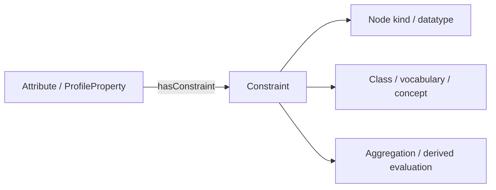
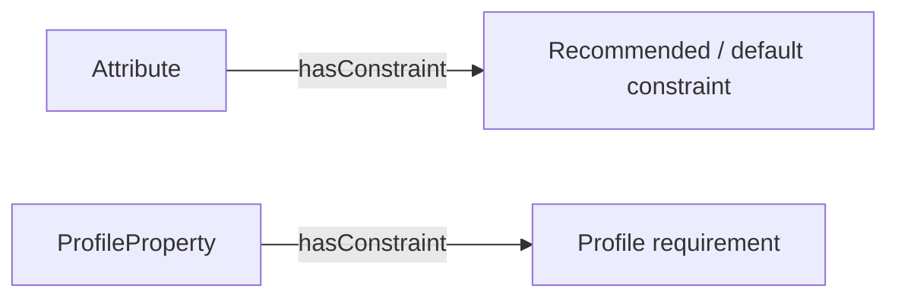
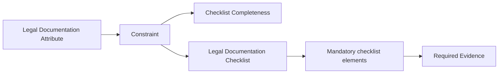
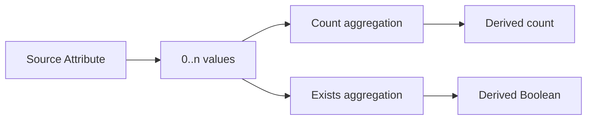
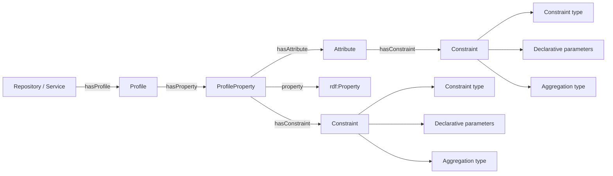

# Modelling Constraints in TRSP

## Purpose

The TRSP Constraint model provides a compact way to describe expectations, restrictions, evaluations, transformations, and aggregations associated with Attributes and Profile Properties.

It complements the Attribute and Profile models:

- an **Attribute** identifies the characteristic being described;
- a **ProfileProperty** identifies how a particular profile represents that characteristic;
- a **Constraint** describes restrictions or evaluation rules applicable to the value.

The model is designed to avoid creating a separate named resource or bespoke SHACL shape for every constraint attached to every Attribute. Each Constraint explicitly identifies its general type using `trsp:constraintType`. Simple constraints can then be expressed using parameters of a small blank node, while more complex or computed constraints can refer to reusable aggregation operations.

The same constraint vocabulary can be used in two contexts with different force:

- on an **Attribute**, a constraint normally represents consolidated guidance, a recommendation, or a default;
- on a **ProfileProperty**, a constraint can represent an actual requirement of the applicable profile.

Detailed assessment workflows, tests, metrics, and benchmark execution are separate concerns, and are not addressed by the Knowledge Base resources.

---

# Part I — Conceptual Guide for Repository and Service Managers

## 1. Why constraints are needed

An Attribute identifies a characteristic, but the characteristic alone does not always say what kind of value is expected.

For example, an Attribute may require or recommend that its value:

- is an IRI rather than a literal;
- is a literal of a particular datatype;
- is an instance of a particular class, such as an Institution or Evidence;
- is selected from a particular controlled vocabulary;
- is one particular concept;
- satisfies all mandatory elements of a checklist;
- is calculated from the values of another Attribute;
- reports whether one or more qualifying values exist.

The Constraint model records these additional expectations without changing the identity of the Attribute itself.



## 2. Simple constraints and computed constraints

Every Constraint explicitly identifies its general type using `trsp:constraintType`. The type is selected from the TRSP Constraint Types concept scheme (`trsp:typeConstraint`) rather than being inferred from properties such as `nodeKind`, `datatype`, or `valueClass`.

The current constraint types are:

```text
trsp:iriConstraint
trsp:dataTypeConstraint
trsp:vocabularyConstraint
trsp:classConstraint
trsp:aggregationConstraint
trsp:checklistConstraint
```

The constraint type identifies the general kind of rule. Other properties of the Constraint provide the parameters needed to apply that rule.

TRSP distinguishes conceptually between two broad forms of constraint.

### Simple declarative constraints

These state what a value must look like or what semantic category it must belong to.

Examples include:

```text
Value must be an IRI
Value must be an xsd:boolean literal
Value must be an instance of trsp:Evidence
Value must come from the Repository Type concept scheme
Value must be a particular SKOS Concept
```

These constraints do not require a named algorithm. Their general kind is stated explicitly using `constraintType`, while properties such as `nodeKind`, `datatype`, `valueClass`, `conceptScheme`, and `concept` provide the applicable parameters.

### Computed or aggregation constraints

Other requirements involve evaluating, combining, or transforming values.

Examples include:

```text
Count the Evidence instances supplied for another Attribute
Return true if at least one qualifying Evidence instance exists
Check whether all mandatory items in a checklist have been satisfied
Calculate a minimum, maximum, average, union, unique list, or other aggregation
```

These constraints use `aggregationConstraint` or `checklistConstraint` as their general constraint type. The specific operation is identified separately from the TRSP Aggregation Types vocabulary and, where necessary, the Attribute supplying the input values.

## 3. Constraints do not replace the Attribute

A Constraint is supplementary information about an Attribute or ProfileProperty.

For example:

```text
Attribute: Publisher
    value should be an IRI
    value should be an instance of Institution
```

The Attribute remains **Publisher**. The constraint merely states expectations concerning its value.

Similarly:

```text
Attribute: Repository Type
    value should come from Repository Type vocabulary
```

does not turn the Repository Type vocabulary into the Attribute. It identifies the vocabulary from which acceptable values are drawn.

## 4. Attribute guidance versus Profile requirements

The same constraint mechanism is used at Attribute and ProfileProperty level, but the interpretation differs.



At Attribute level, constraints capture consolidated guidance or best practice. They describe what TRSP considers a useful or typical representation of the characteristic.

At ProfileProperty level, constraints describe the actual rules of a particular profile and may therefore be mandatory.

This is quite an important feature of profile property declarations: the ability to have divergent benchmarks and associated constraints by virtue of separating these elements from the rest of the profile property definition.

For example:

```text
Attribute: Publisher
    recommended value class: Institution

Profile A / Publisher
    required value class: Institution
    required node kind: IRI

Profile B / Publisher
    required value class: Agent
```

A Profile is therefore not required to inherit every Attribute recommendation unchanged. It may repeat, refine, or override the guidance according to the source specification being represented.

## 5. Controlled-vocabulary constraints

Many repository and service characteristics are represented using controlled vocabularies.

A Constraint can identify a SKOS Concept Scheme from which values are expected:

```text
Attribute: Repository Type
Constraint:
    concept scheme = Repository Types
```

A Constraint can alternatively identify one particular SKOS Concept where the acceptable or required value is more specific.

This pattern keeps the Attribute, the vocabulary, and the selected vocabulary value as distinct resources.

## 6. Checklist constraints

A checklist is a useful special case of a controlled vocabulary.

For example, a Legal Documentation checklist may contain concepts representing:

- privacy documentation;
- terms of use;
- data-processing documentation;
- intellectual-property documentation;
- other applicable legal documents.

Some checklist concepts may be mandatory while others are optional.

A checklist-completeness constraint can state that the evidence supplied for an Attribute must satisfy all checklist elements designated as mandatory.



The mechanism used to designate checklist concepts as mandatory is part of the checklist model and can be defined separately.

## 7. Derived and aggregated Attributes

Some Attributes describe values derived from other Attributes.

For example, one Attribute may contain the Evidence instances corresponding to legal documentation:

```text
Legal Documentation
    → Evidence 1
    → Evidence 2
    → Evidence 3
```

A second Attribute may report the number of such values:

```text
Legal Document Count = 3
```

A third may provide a simple Boolean summary:

```text
Has Legal Document List = true
```

These derived Attributes can identify the source Attribute and the aggregation to apply.



This allows detailed evidence and convenient summary characteristics to coexist without duplicating the underlying information.

## 8. Relationship to SHACL

The TRSP Constraint model describes **what rule applies**. SHACL can provide one implementation of that rule.

Simple constraints have direct SHACL equivalents:

```text
TRSP nodeKind = sh:IRI          → SHACL sh:nodeKind sh:IRI
TRSP datatype = xsd:string      → SHACL sh:datatype xsd:string
TRSP valueClass = trsp:Evidence → SHACL sh:class trsp:Evidence
```

More complex constraints may require SHACL-SPARQL, SPARQL queries, application code, or another execution mechanism.

The TRSP representation therefore remains a portable description of the constraint rather than embedding implementation-specific validation logic into every Attribute.

---

# Part II — Encoding Guidance for Developers and Data Scientists

## 9. Constraint class and constraint type

The common class is `trsp:Constraint`. Each Constraint explicitly identifies its general type using `trsp:constraintType`; consuming software therefore does not need to infer the constraint type from the presence of parameter properties.

```turtle
trsp:Constraint
    a owl:Class ;
    rdfs:label "Constraint"@en ;
    skos:definition
        "A parameterised specification of a restriction, expectation, evaluation, transformation, or aggregation applicable to the value of an Attribute or Profile Property."@en ;
    rdfs:comment
        "Each Constraint explicitly identifies its general type using trsp:constraintType. Additional properties supply the parameters required by that type."@en .
```

Constraints will normally be represented as blank nodes because the individual parameterisation generally has no independent identity.

The classification property is:

```turtle
trsp:constraintType
    a owl:ObjectProperty ;
    rdfs:domain trsp:Constraint ;
    rdfs:range skos:Concept ;
    rdfs:label "constraint type"@en ;
    skos:definition
        "Identifies the general type of constraint represented by a Constraint."@en .
```

The value is a concept in `trsp:typeConstraint`. Exactly one constraint type is expected for each Constraint.

`trsp:typeConstraint` and the individual constraint-type concepts are maintained in a separate TRSP vocabulary TTL file. The core ontology references that Concept Scheme rather than duplicating the vocabulary definitions. Validation of scheme membership therefore requires the vocabulary graph to be available to the SHACL processor.

The existing `iriConstraint`, `dataTypeConstraint`, `vocabularyConstraint`, and `classConstraint` concepts are retained. Their scope is generalised from their earlier use for benchmark evidence so that they classify constraints applicable to Attribute and ProfileProperty values. `aggregationConstraint` and `checklistConstraint` extend the scheme for computed and checklist evaluations.

The distinction between type and parameters is deliberate. For example:

```turtle
trsp:constraintType trsp:classConstraint ;
trsp:nodeKind sh:IRI ;
trsp:valueClass trsp:Institution .
```

`classConstraint` identifies the kind of rule, while `sh:IRI` and `trsp:Institution` provide information needed to apply it.

## 10. Associating a Constraint with an Attribute or ProfileProperty

The association property is:

```turtle
trsp:hasConstraint
    a owl:ObjectProperty ;
    rdfs:range trsp:Constraint ;
    rdfs:label "has constraint"@en ;
    skos:definition
        "Relates an Attribute or Profile Property to a constraint applicable to its value or evaluation."@en .
```

No `rdfs:domain` is asserted because the property is intended for both `trsp:Attribute` and `trsp:ProfileProperty`.

Example:

```turtle
trsp:att.publisher
    trsp:hasConstraint [
        a trsp:Constraint ;
        trsp:constraintType trsp:classConstraint ;
        trsp:nodeKind sh:IRI ;
        trsp:valueClass trsp:Institution
    ] .
```

## 11. Node-kind constraints

`trsp:nodeKind` identifies the required RDF node kind.

```turtle
trsp:nodeKind
    a owl:ObjectProperty ;
    rdfs:domain trsp:Constraint ;
    rdfs:range sh:NodeKind ;
    rdfs:label "node kind"@en ;
    skos:definition
        "Identifies the required RDF node kind of a value."@en .
```

Values can use SHACL node-kind resources such as:

```turtle
sh:IRI
sh:Literal
sh:BlankNode
sh:BlankNodeOrIRI
sh:BlankNodeOrLiteral
sh:IRIOrLiteral
```

For example:

```turtle
trsp:att.publisher
    trsp:hasConstraint [
        a trsp:Constraint ;
        trsp:constraintType trsp:iriConstraint ;
        trsp:nodeKind sh:IRI
    ] .
```

This is distinct from an `xsd:anyURI` literal. `sh:IRI` constrains the RDF term itself to be an IRI, whereas `xsd:anyURI` is a datatype for a literal.

## 12. Datatype constraints

`trsp:datatype` identifies the required datatype of a literal.

```turtle
trsp:datatype
    a owl:ObjectProperty ;
    rdfs:domain trsp:Constraint ;
    rdfs:range rdfs:Datatype ;
    rdfs:label "datatype"@en ;
    skos:definition
        "Identifies the RDF datatype required for a literal value."@en .
```

Example:

```turtle
trsp:att.someBooleanAttribute
    trsp:hasConstraint [
        a trsp:Constraint ;
        trsp:constraintType trsp:dataTypeConstraint ;
        trsp:nodeKind sh:Literal ;
        trsp:datatype xsd:boolean
    ] .
```

Other examples include `xsd:string`, `xsd:integer`, `xsd:date`, `xsd:dateTime`, and `xsd:anyURI`.

## 13. Class constraints

`trsp:valueClass` identifies the class of which a resource-valued value is expected to be an instance.

```turtle
trsp:valueClass
    a owl:ObjectProperty ;
    rdfs:domain trsp:Constraint ;
    rdfs:range rdfs:Class ;
    rdfs:label "value class"@en ;
    skos:definition
        "Identifies the class of which a resource-valued value is required or expected to be an instance."@en .
```

Example:

```turtle
trsp:att.governanceEvidence
    trsp:hasConstraint [
        a trsp:Constraint ;
        trsp:constraintType trsp:classConstraint ;
        trsp:nodeKind sh:IRI ;
        trsp:valueClass trsp:Evidence
    ] .
```

The corresponding SHACL implementation can use:

```turtle
sh:nodeKind sh:IRI ;
sh:class trsp:Evidence .
```

## 14. Concept Scheme and Concept constraints

A controlled-vocabulary restriction uses `trsp:conceptScheme`:

```turtle
trsp:conceptScheme
    a owl:ObjectProperty ;
    rdfs:domain trsp:Constraint ;
    rdfs:range skos:ConceptScheme ;
    rdfs:label "concept scheme"@en ;
    skos:definition
        "Identifies a SKOS Concept Scheme from which an applicable value, set of values, or checklist is drawn."@en .
```

Example:

```turtle
trsp:att.repositoryType
    trsp:hasConstraint [
        a trsp:Constraint ;
        trsp:constraintType trsp:vocabularyConstraint ;
        trsp:nodeKind sh:IRI ;
        trsp:conceptScheme trsp:typeRepository
    ] .
```

Where a particular concept is required or used, `trsp:concept` can be used:

```turtle
trsp:concept
    a owl:ObjectProperty ;
    rdfs:domain trsp:Constraint ;
    rdfs:range skos:Concept ;
    rdfs:label "concept"@en ;
    skos:definition
        "Identifies a specific SKOS Concept required or otherwise used by the constraint."@en .
```

Scheme membership can be validated in SHACL using `skos:inScheme` and `sh:hasValue`.

## 15. Computed constraints and aggregation types

Computed constraints use the existing TRSP Aggregation Types concept scheme.

```turtle
trsp:aggregationType
    a owl:ObjectProperty ;
    rdfs:domain trsp:Constraint ;
    rdfs:range skos:Concept ;
    rdfs:label "aggregation type"@en ;
    skos:definition
        "Identifies the aggregation, transformation, or computed evaluation operation applied by the constraint."@en .
```

The value is constrained to a concept in `trsp:typeAggregation`.

Existing aggregation concepts include operations such as:

```text
Count
Exists
Map
Match
Sum
Minimum
Maximum
Average
Median
First
Last
List
Union
Coverage
Named Entity Recognition
Inherit
Category Count
Equals
ChecklistCompleteness
```

The example below shows how such concepts are encoded, using the Checklist Completeness constraint as an example:

```turtle
trsp:aggregationChecklistCompleteness
    a skos:Concept ;
    skos:inScheme trsp:typeAggregation ;
    skos:prefLabel "Checklist Completeness"@en ;
    skos:definition
        "Evaluate whether the values or evidence supplied satisfy all mandatory elements identified by a checklist represented as a SKOS Concept Scheme."@en .
```

## 16. Source Attributes

A computed constraint can identify another Attribute as its input:

```turtle
trsp:sourceAttribute
    a owl:ObjectProperty ;
    rdfs:domain trsp:Constraint ;
    rdfs:range trsp:Attribute ;
    rdfs:label "source attribute"@en ;
    skos:definition
        "Identifies an Attribute whose value or values provide input to a computed constraint, transformation, or aggregation."@en .
```

For example:

```turtle
trsp:att.legalDocumentCount
    trsp:hasConstraint [
        a trsp:Constraint ;
        trsp:constraintType trsp:aggregationConstraint ;
        trsp:aggregationType trsp:aggregationCount ;
        trsp:sourceAttribute trsp:att.legalDocumentation
    ] .
```

A Boolean existence summary can use the same source:

```turtle
trsp:att.hasLegalDocumentList
    trsp:hasConstraint [
        a trsp:Constraint ;
        trsp:constraintType trsp:aggregationConstraint ;
        trsp:aggregationType trsp:aggregationExists ;
        trsp:sourceAttribute trsp:att.legalDocumentation
    ] .
```

## 17. Checklist completeness

Checklist completeness combines an aggregation operation with a Concept Scheme parameter.

```turtle
trsp:att.legalDocumentation
    trsp:hasConstraint [
        a trsp:Constraint ;
        trsp:constraintType trsp:checklistConstraint ;
        trsp:aggregationType trsp:aggregationChecklistCompleteness ;
        trsp:conceptScheme trsp:legalDocumentationChecklist
    ] .
```

The Constraint states:

1. which operation is required;
2. which checklist supplies the applicable elements.

The checklist model separately determines which concepts are mandatory and how evidence corresponds to checklist items.

This separation allows the same checklist-completeness operation to be reused with many different checklist schemes.

## 18. SHACL restriction of constraint and aggregation types

`trsp:constraintType` has the broad OWL range `skos:Concept`, while SHACL can require exactly one value and restrict it to the TRSP Constraint Types concept scheme:

```turtle
trsp:ConstraintTypePropertyShape
    a sh:PropertyShape ;
    sh:path trsp:constraintType ;
    sh:minCount 1 ;
    sh:maxCount 1 ;
    sh:nodeKind sh:IRI ;
    sh:class skos:Concept ;
    sh:node [
        a sh:NodeShape ;
        sh:property [
            sh:path skos:inScheme ;
            sh:hasValue trsp:typeConstraint
        ]
    ] ;
    sh:message
        "A Constraint must have exactly one constraint type from the TRSP Constraint Types concept scheme."@en .
```

Similarly, although `trsp:aggregationType` has the broad OWL range `skos:Concept`, SHACL can require its values to belong to the appropriate Concept Scheme.

```turtle
trsp:AggregationTypePropertyShape
    a sh:PropertyShape ;
    sh:path trsp:aggregationType ;
    sh:nodeKind sh:IRI ;
    sh:class skos:Concept ;
    sh:node [
        a sh:NodeShape ;
        sh:property [
            sh:path skos:inScheme ;
            sh:hasValue trsp:typeAggregation
        ]
    ] ;
    sh:message
        "The value of trsp:aggregationType must be a SKOS Concept in the TRSP Aggregation Types concept scheme."@en .
```

This follows the same design principle used for cardinality types, measurement types, and benchmark types: OWL identifies the broad semantic type, while SHACL restricts values to the intended vocabulary.

The core ontology groups these reusable property constraints in `trsp:ConstraintShape`, which targets `trsp:Constraint`. `ConstraintShape` attaches `trsp:ConstraintTypePropertyShape` and `trsp:AggregationTypePropertyShape`; the first requires exactly one constraint type, while the second validates aggregation-type values when present.

## 19. Constraint-to-SHACL correspondence

Simple TRSP constraints can be translated directly into SHACL.

| TRSP constraint element | Typical role / SHACL representation |
|---|---|
| `trsp:constraintType trsp:iriConstraint` | Explicitly classifies the rule as an IRI constraint |
| `trsp:constraintType trsp:classConstraint` | Explicitly classifies the rule; `valueClass` supplies the required class |
| `trsp:nodeKind sh:IRI` | `sh:nodeKind sh:IRI` |
| `trsp:nodeKind sh:Literal` | `sh:nodeKind sh:Literal` |
| `trsp:datatype xsd:string` | `sh:datatype xsd:string` |
| `trsp:valueClass trsp:Evidence` | `sh:class trsp:Evidence` |
| `trsp:conceptScheme ex:scheme` | constraint on `skos:inScheme ex:scheme` |
| `trsp:concept ex:concept` | typically `sh:hasValue ex:concept` |

Computed constraints do not necessarily have a single SHACL Core equivalent. They may be implemented using SHACL-SPARQL, SPARQL, application logic, or another execution mechanism.

The TRSP constraint description should therefore be treated as the semantic specification of the rule, not as a commitment to one execution technology.

## 20. Integrated model

The three modelling layers now fit together as follows:



This separates:

1. **the resource being described** — Repository or Service;
2. **the description specification** — Profile;
3. **the profile-specific use of a property** — ProfileProperty;
4. **the characteristic being described** — Attribute;
5. **the RDF predicate used to encode it** — RDF property;
6. **the restrictions or computations applicable to its value** — Constraint.

## 21. Implementation principles

When implementing TRSP constraints:

1. Use `trsp:Constraint` as the common parameterised constraint resource.
2. Give every Constraint exactly one explicit `trsp:constraintType` from `trsp:typeConstraint`.
3. Do not infer the general constraint type from parameter properties such as `nodeKind`, `datatype`, or `valueClass`.
4. Use blank nodes for constraint instances unless a constraint needs independent identity or reuse.
5. Use `trsp:hasConstraint` for both Attributes and ProfileProperties.
6. Do not assert a restrictive RDFS domain on `trsp:hasConstraint`.
7. Prefer declarative parameters for simple constraints rather than inventing named algorithms.
8. Use `trsp:nodeKind` for RDF node-kind requirements.
9. Use `trsp:datatype` for literal datatype requirements.
10. Use `trsp:valueClass` for class membership requirements.
11. Use `trsp:conceptScheme` for controlled-vocabulary and checklist restrictions.
12. Use `trsp:concept` when a specific SKOS Concept is required or referenced.
13. Use `trsp:aggregationType` only where evaluation, transformation, or aggregation is required.
14. Select aggregation operations from `trsp:typeAggregation`.
15. Use `trsp:sourceAttribute` where another Attribute supplies input to a computed value.
16. Treat Attribute-level constraints as recommendations or defaults unless another specification explicitly gives them normative force.
17. Treat ProfileProperty-level constraints according to the requirements of the applicable Profile.
18. Keep the semantic constraint description separate from its SHACL, SPARQL, or application implementation.

## 22. Key takeaway

The Constraint model adds a reusable third layer to TRSP's Attribute and Profile models.

Every Constraint explicitly identifies its **constraint type**, so consuming software does not need to infer the type from its parameter properties. A Constraint can then express expectations such as **IRI**, **literal datatype**, **instance of a class**, **value from a Concept Scheme**, or **specific Concept** without requiring a bespoke algorithm.

Where a value must be calculated or evaluated, the same Constraint can identify a reusable operation from the TRSP Aggregation Types vocabulary and identify its inputs.

This provides a compact way to enrich thousands of Attributes and ProfileProperties while keeping the semantic description of a constraint separate from the technology used to execute or validate it.
