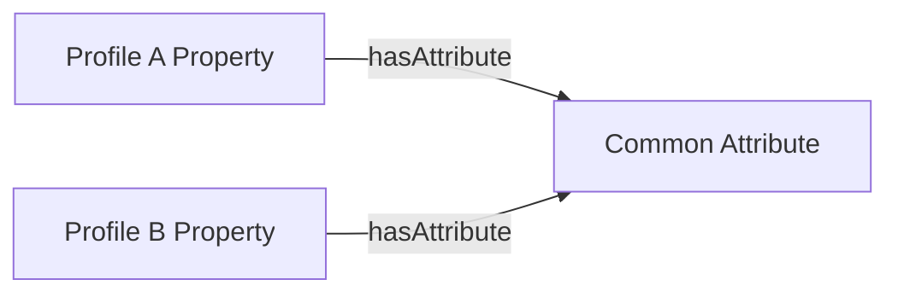
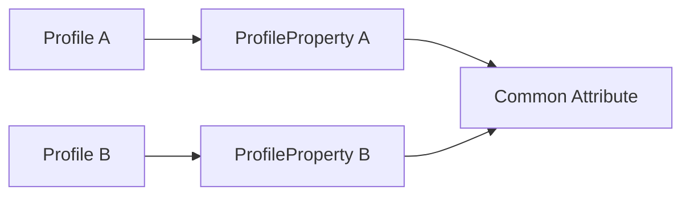
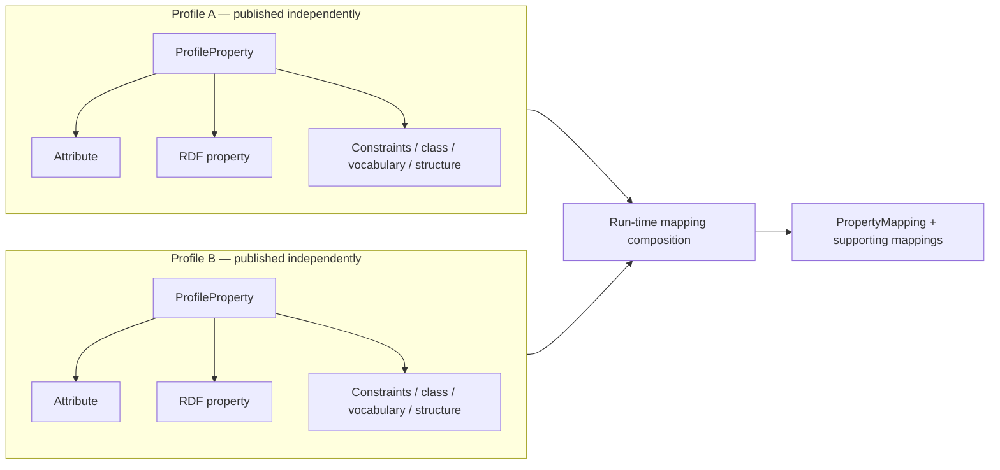
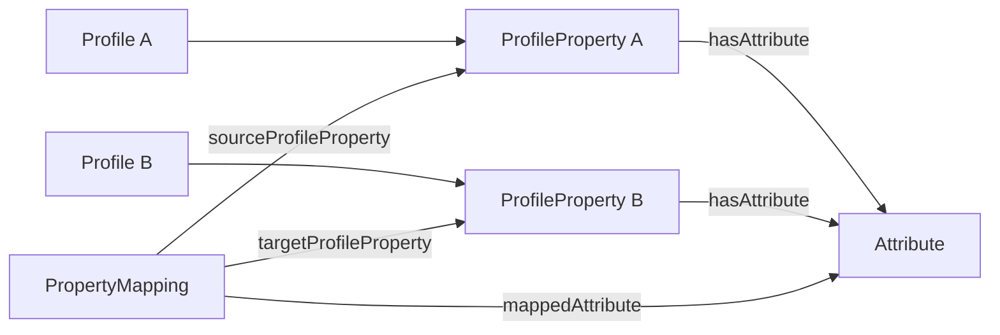

# Mapping Between Profiles in TRSP

## Purpose

TRSP uses Attributes as neutral semantic reference points between Profiles. Two Profile Properties can describe the same characteristic while using different RDF properties, classes, controlled vocabularies, value encodings, or graph structures.

The Mapping model records the additional knowledge needed to relate those representations.

The central design principle is:

> **The Attribute identifies semantic commonality; the Mapping describes the pairwise conversion.**

A mapping therefore does not belong to the Attribute itself. The transformation required between Profile A and Profile B may be different from the transformation required between Profile A and Profile C, even where all three Profile Properties refer to the same Attribute.

The model is intended to capture mapping knowledge in a reusable, machine-readable form. It does not assume that every mapping is automatically executable. Implementations can translate suitable mappings into SPARQL, SHACL rules, RML, application code, or another transformation mechanism.

A further distinction is essential:

- **Profile-provided mapping metadata** is published with each Profile independently of any particular mapping. It describes what a ProfileProperty means and how its values are represented. The ProfileProperty is the authoritative source for its RDF property, constraints, classes, controlled vocabularies, and any intrinsic structural description.
- **Run-time mapping resources** are constructed when a source Profile and target Profile are paired. They describe the actual correspondence or transformation between those two representations.

The objective is that a mapping service can inspect two independently published Profiles and compose a mapping on demand, without requiring either Profile to have been authored specifically for the other.

---

# Part I — Conceptual Guide for Repository and Service Managers

## 1. Why mappings are needed

Profiles frequently describe the same characteristic differently.

For example, two repository profiles may both describe a publisher, but one may use:

```text
Property: dcterms:publisher
Value: an Agent
```

while another uses:

```text
Property: trsp:organisation
Value: an Organisation
Role: publisherOrganisation
```

The shared idea is **Publisher**. TRSP represents that shared meaning as an Attribute.

The Profile Properties then describe how each Profile represents Publisher.



This common Attribute is sufficient to discover that the Profile Properties are candidates for mapping. It is not necessarily sufficient to perform the conversion.

## 2. Attribute as semantic pivot

The Attribute vocabulary provides a neutral layer between Profiles.



This is useful even when the RDF properties differ.

For example:

```text
Profile A Property → dcterms:publisher
Profile B Property → trsp:organisation
Both               → Publisher Attribute
```

The Attribute therefore answers:

> **Are these Profile Properties describing the same characteristic?**

The Mapping answers a different question:

> **How can a representation using one Profile Property be converted to the other?**

## 3. Why mappings are pairwise

It would be tempting to attach a single mapping algorithm to the Attribute. This does not work for heterogeneous Profiles.

Suppose three Profiles all describe the same Publisher Attribute:

```text
Profile A → dcterms:publisher → foaf:Agent
Profile B → trsp:organisation → trsp:Organisation + publisher role
Profile C → schema:publisher → schema:Organization
```

The transformation from A to B can differ from A to C and B to C.

Consequently:

```text
Attribute
    identifies common meaning

ProfileProperty A ↔ ProfileProperty B
    has one mapping

ProfileProperty A ↔ ProfileProperty C
    may have another mapping
```

Mapping type, algorithm, constants, value mappings, and structural rules therefore belong to the **pairwise Mapping**, not to the Attribute.

## 4. Levels of mapping

Mappings can occur at several levels.

### Profile mapping

A Profile Mapping groups the mappings needed to relate two Profiles.

```text
Profile A
    ↓
Profile Mapping
    ↓
Profile B
```

### Class mapping

A Class Mapping describes how a class or class-like structure in the source corresponds to one in the target.

For example:

```text
foaf:Agent
    →
trsp:Organisation
```

A class correspondence does not necessarily mean that the classes are globally equivalent. It records the correspondence needed in the context of this profile-to-profile transformation.

### Property mapping

A Property Mapping relates a source ProfileProperty to a target ProfileProperty.

This is the most important level for Attribute-based discovery because both Profile Properties can identify their common Attribute.

### Value or concept mapping

The source and target may use different controlled vocabularies or encoded values.

For example:

```text
Source concept A → Target concept X
Source concept B → Target concept Y
```

These correspondences belong to the applicable mapping rather than being assumed globally.

## 5. Simple mappings

Some mappings require little more than a property substitution.

For example:

```text
Profile A:
    ex:contactEmail

Profile B:
    schema:email
```

If both Profile Properties point to the same Email Attribute and have compatible value constraints, the mapping may be essentially a rename.

The mapping can still be recorded explicitly so that software does not need to infer that the two properties are interchangeable.

## 6. Structural mappings

More difficult mappings change graph structure.

Consider the publisher example.

Source:

```turtle
dcterms:publisher [
    a foaf:Agent ;
    ...
] .
```

Target:

```turtle
trsp:organisation [
    a trsp:Organisation ;
    trsp:organisationType trsp:publisherOrganisation ;
    ...
] .
```

The mapping involves more than changing one predicate:

1. `dcterms:publisher` becomes `trsp:organisation`;
2. the source `foaf:Agent` is represented as `trsp:Organisation`;
3. the target node receives an additional role assertion;
4. the role value is the controlled concept `trsp:publisherOrganisation`.

This is why the mapping model needs to support class mappings and additional fixed assertions as well as property correspondences. The source and target predicates or structures themselves are obtained from the referenced ProfileProperty definitions rather than repeated in the pairwise mapping.

## 7. Qualifiers and fixed target values

Sometimes the source structure implies information that the target represents explicitly.

In the publisher example, the fact that the source node is reached through `dcterms:publisher` already tells us that the Agent is acting as a publisher. The target model represents that role explicitly:

```turtle
trsp:organisationType trsp:publisherOrganisation .
```

TRSP can represent this as a **Mapping Qualifier**: an additional property/value assertion introduced by the mapping.

This avoids introducing a special placeholder such as `trsp:propertyObject`. The mapping engine already knows that it is processing the value reached through the source path. What needs to be represented declaratively is the extra target assertion.

## 8. Controlled-vocabulary mappings

Two Profiles may represent the same Attribute using different Concept Schemes.

```text
Profile A → Repository Type Scheme A
Profile B → Repository Type Scheme B
```

The common Attribute establishes that the properties concern Repository Type. A Value Mapping can then state the pairwise correspondence between individual concepts.

These mappings may be:

- one-to-one;
- one-to-many;
- many-to-one;
- approximate;
- conditional.

Existing SKOS mapping properties such as `skos:exactMatch`, `skos:closeMatch`, and `skos:relatedMatch` can still be used where their semantics are appropriate. A TRSP Value Mapping is useful when the correspondence is specifically part of a profile transformation or needs additional mapping metadata.

## 9. Mapping candidates versus executable transformations

A machine-readable mapping can provide enough information to:

- identify source and target Profile Properties;
- identify their common Attribute;
- describe relevant source and target classes, while obtaining predicates or intrinsic traversal paths from the referenced ProfileProperty definitions;
- identify source and target Concept Schemes;
- list value correspondences;
- identify a mapping type;
- identify a reusable mapping algorithm;
- supply fixed target assertions.

The source and target RDF properties or intrinsic structures are obtained from the referenced ProfileProperties and are not repeated as `sourcePath` and `targetPath` on the mapping.

This does not mean that every mapping must be executable directly from the RDF declaration.

The mapping resource can act as a **mapping specification or candidate** from which a human or transformation service constructs the final executable mapping.

This is especially important for complex structural transformations where the Profile describes the available schema but cannot anticipate every possible source-target pairing.

## 10. What a Profile must publish for on-demand mapping

A Profile should not contain pairwise mappings to every other Profile. Instead, each Profile should publish enough information about each ProfileProperty for a mapping service to understand it independently.

| Profile information | Why it is needed for mapping |
|---|---|
| Profile identity and type | Identifies the specification being interpreted |
| `Profile → hasProperty → ProfileProperty` | Enumerates the properties defined by the Profile |
| `ProfileProperty → hasAttribute → Attribute` | Provides the neutral semantic pivot used to discover candidate correspondences |
| `ProfileProperty → property → rdf:Property` | Identifies the RDF predicate used by the Profile |
| applicable `Constraint` information | Describes expected node kind, datatype, class, Concept Scheme, specific concept, or other value restrictions |
| class information | Describes the class expected for resource-valued properties |
| controlled-vocabulary information | Identifies the Concept Scheme or concepts from which values are drawn |
| structural information, where required | Describes the intrinsic graph structure of the ProfileProperty when it is not represented by a simple direct predicate |
| cardinality and related ProfileProperty requirements | Helps determine whether source and target representations are structurally compatible |

This is **profile metadata**. It is useful whether the Profile later acts as a mapping source or as a mapping target.

For example, a Publisher ProfileProperty can independently state:

```text
Attribute        = Publisher
RDF property     = dcterms:publisher
node kind        = IRI or blank node
value class      = foaf:Agent
```

Another Profile can independently state:

```text
Attribute        = Publisher
RDF property     = trsp:organisation
value class      = trsp:Organisation
organisationType = controlled vocabulary
```

A mapping service can discover that the two ProfileProperties share the Publisher Attribute and determine which additional transformation knowledge is needed.

### Information normally created at run time

The following describe the **relationship between two Profiles** and therefore normally do not need to be embedded in either Profile beforehand:

```text
ProfileMapping
ClassMapping
PropertyMapping
ValueMapping
MappingQualifier

sourceProfile / targetProfile
sourceProfileProperty / targetProfileProperty
sourceClass / targetClass
sourceValue / targetValue
sourceConceptScheme / targetConceptScheme

mappingType
mappingAlgorithm
mappedAttribute
```

A generated mapping may subsequently be saved and reused, but conceptually it is a product of pairing two Profiles rather than an intrinsic definition of either Profile.

### Design-time versus run-time model



The architectural rule is:

> **Profiles describe themselves; mappings describe relationships between Profiles.**

A Profile supplies the stable metadata needed to participate in mappings. Pair-specific source/target roles and transformations are created only when required.

## 12. Direction matters

Mappings are represented with an explicit source and target.

A transformation from Profile A to Profile B may not be reversible. For example:

```text
A → B
```

may add a fixed role, aggregate values, reduce detail, or map several source concepts to one target concept.

The reverse transformation:

```text
B → A
```

can therefore require a separate Mapping.

---

# Part II — Encoding Guidance for Developers and Data Scientists

## 12. Mapping model overview

The mapping model has four principal classes:

```text
ProfileMapping
    ├── ClassMapping
    └── PropertyMapping
            └── ValueMapping
```

A supporting `MappingQualifier` represents fixed assertions introduced in the target structure.

The levels are deliberately separable. A simple transformation may require only a `PropertyMapping`; a comprehensive Profile-to-Profile crosswalk can group many class and property mappings in a `ProfileMapping`.

### Profile metadata versus mapping-instance data

From an implementation perspective, the persistent Profile graph should be separate from the graph created by a mapping service.

A **Profile graph** contains stable statements such as:

```turtle
ex:publisherProfileProperty
    a trsp:ProfileProperty ;
    trsp:hasAttribute trsp:att.publisher ;
    trsp:property dcterms:publisher ;
    trsp:hasConstraint [
        a trsp:Constraint ;
        trsp:constraintType trsp:classConstraint ;
        trsp:valueClass foaf:Agent
    ] .
```

This definition does not say whether the ProfileProperty will later be a source or a target.

A **mapping graph**, created after another Profile is selected, can then contain:

```turtle
ex:publisherMapping
    a trsp:PropertyMapping ;
    trsp:sourceProfileProperty ex:publisherProfileProperty ;
    trsp:targetProfileProperty ex:organisationProfileProperty ;
    trsp:mappedAttribute trsp:att.publisher ;
    trsp:mappingType trsp:structuralMapping .
```

The mapping graph can be temporary, cached, reviewed and persisted, or published as a reusable crosswalk. Its lifecycle is separate from the Profile definitions.

`sourceProfileProperty` and `targetProfileProperty` are retained because they identify the two ProfileProperty resources participating in the mapping. Separate `sourcePath` and `targetPath` properties are not required: their representation is derived from those ProfileProperty definitions. This avoids duplicating stable Profile metadata in every pairwise mapping.

## 13. ProfileMapping

```turtle
trsp:ProfileMapping
    a owl:Class ;
    rdfs:label "Profile Mapping"@en ;
    skos:definition
        "A mapping specification relating representations defined by a source Profile and a target Profile."@en .
```

The source and target are explicit:

```turtle
trsp:sourceProfile
    a owl:ObjectProperty ;
    rdfs:domain trsp:ProfileMapping ;
    rdfs:range trsp:Profile .

trsp:targetProfile
    a owl:ObjectProperty ;
    rdfs:domain trsp:ProfileMapping ;
    rdfs:range trsp:Profile .
```

Example:

```turtle
ex:profileAToProfileB
    a trsp:ProfileMapping ;
    trsp:sourceProfile ex:ProfileA ;
    trsp:targetProfile ex:ProfileB .
```

## 14. ClassMapping

A class mapping records a class-level correspondence needed by the transformation.

```turtle
trsp:ClassMapping
    a owl:Class ;
    rdfs:label "Class Mapping"@en .

trsp:sourceClass
    a owl:ObjectProperty ;
    rdfs:domain trsp:ClassMapping ;
    rdfs:range rdfs:Class .

trsp:targetClass
    a owl:ObjectProperty ;
    rdfs:domain trsp:ClassMapping ;
    rdfs:range rdfs:Class .
```

For example:

```turtle
ex:agentToOrganisation
    a trsp:ClassMapping ;
    trsp:sourceClass foaf:Agent ;
    trsp:targetClass trsp:Organisation .
```

This is a mapping statement in a particular transformation context. It should not automatically be interpreted as a global `owl:equivalentClass` assertion.

## 15. PropertyMapping

`PropertyMapping` is the pairwise mapping between Profile Properties.

```turtle
trsp:PropertyMapping
    a owl:Class ;
    rdfs:label "Property Mapping"@en ;
    skos:definition
        "A pairwise mapping specification relating a source Profile Property to a target Profile Property that normally describe a common Attribute."@en .
```

The endpoints are:

```turtle
trsp:sourceProfileProperty
    a owl:ObjectProperty ;
    rdfs:domain trsp:PropertyMapping ;
    rdfs:range trsp:ProfileProperty .

trsp:targetProfileProperty
    a owl:ObjectProperty ;
    rdfs:domain trsp:PropertyMapping ;
    rdfs:range trsp:ProfileProperty .
```

The common Attribute can be made explicit:

```turtle
trsp:mappedAttribute
    a owl:ObjectProperty ;
    rdfs:domain trsp:PropertyMapping ;
    rdfs:range trsp:Attribute .
```

Although the Attribute can be reached through `trsp:hasAttribute` on both Profile Properties, explicitly recording it on the PropertyMapping is useful for querying, indexing, and QA.

## 16. Grouping mappings

A Profile Mapping can contain Class Mappings:

```turtle
trsp:hasClassMapping
    a owl:ObjectProperty ;
    rdfs:domain trsp:ProfileMapping ;
    rdfs:range trsp:ClassMapping .
```

Property Mappings can be grouped directly under a Profile Mapping or within a Class Mapping:

```turtle
trsp:hasPropertyMapping
    a owl:ObjectProperty ;
    rdfs:range trsp:PropertyMapping .
```

No RDFS domain is asserted for `hasPropertyMapping`, because both grouping patterns are useful.

## 17. Mapping type and algorithm

Mappings can classify the kind of correspondence:

```turtle
trsp:mappingType
    a owl:ObjectProperty ;
    rdfs:range skos:Concept ;
    skos:definition
        "Classifies the kind of correspondence or transformation represented by a mapping."@en .
```

`mappingType` deliberately has the broad range `skos:Concept` and the core ontology does not require one particular Concept Scheme. Implementations are nevertheless recommended to use a controlled vocabulary consistently. Such a vocabulary can distinguish patterns such as:

```text
identity / rename
class conversion
vocabulary mapping
value conversion
structural transformation
constant insertion
aggregation
```

Where executable or reusable transformation logic exists, it can be referenced separately:

```turtle
trsp:mappingAlgorithm
    a owl:ObjectProperty ;
    skos:definition
        "Identifies a reusable algorithm or transformation definition applicable to this particular mapping."@en .
```

The important point is that `mappingAlgorithm` belongs to the **pairwise mapping**. It is not a property of the Attribute because another pair of Profile Properties associated with the same Attribute may require a different algorithm.

## 18. Source and target representation

A `PropertyMapping` identifies its endpoints using `sourceProfileProperty` and `targetProfileProperty`.

The RDF property and intrinsic graph structure used on each side are obtained from those ProfileProperty definitions. They should not normally be repeated on the pairwise mapping.

For example:

```turtle
ex:sourcePublisherProfileProperty
    a trsp:ProfileProperty ;
    trsp:hasAttribute trsp:att.publisher ;
    trsp:property dcterms:publisher ;
    trsp:hasConstraint [
        a trsp:Constraint ;
        trsp:constraintType trsp:classConstraint ;
        trsp:valueClass foaf:Agent
    ] .

ex:targetOrganisationProfileProperty
    a trsp:ProfileProperty ;
    trsp:hasAttribute trsp:att.publisher ;
    trsp:property trsp:organisation ;
    trsp:hasConstraint [
        a trsp:Constraint ;
        trsp:constraintType trsp:classConstraint ;
        trsp:valueClass trsp:Organisation
    ] .
```

The pairwise mapping then needs only to reference those definitions:

```turtle
ex:publisherMapping
    a trsp:PropertyMapping ;
    trsp:sourceProfileProperty ex:sourcePublisherProfileProperty ;
    trsp:targetProfileProperty ex:targetOrganisationProfileProperty ;
    trsp:mappedAttribute trsp:att.publisher ;
    trsp:mappingType trsp:structuralMapping .
```

This makes the ProfileProperty the authoritative description of its representation and avoids repeating the same predicate or path information across many mappings.

If a ProfileProperty has a nested structure that cannot be described by `trsp:property` and its Constraints alone, that intrinsic structure should be described as part of the ProfileProperty definition. A mapping engine can then derive the source and target traversal from the two Profile definitions when composing a mapping.

TRSP provides `trsp:propertyPath` for this purpose. Its value is a SHACL-compatible property-path expression and is used only when a single direct `trsp:property` is insufficient. For example:

```turtle
ex:publisherNameProfileProperty
    a trsp:ProfileProperty ;
    trsp:hasAttribute trsp:att.publisherName ;
    trsp:property dcterms:publisher ;
    trsp:propertyPath ( dcterms:publisher foaf:name ) .
```

The path remains part of the ProfileProperty self-description. A `PropertyMapping` still identifies its endpoints with `sourceProfileProperty` and `targetProfileProperty`; it does not copy the path into source- or target-specific mapping properties.

## 19. Value and Concept Scheme mappings

`ValueMapping` represents value-level correspondences:

```turtle
trsp:ValueMapping
    a owl:Class ;
    rdfs:label "Value Mapping"@en .

trsp:hasValueMapping
    a owl:ObjectProperty ;
    rdfs:range trsp:ValueMapping .

trsp:sourceValue
    a rdf:Property ;
    rdfs:domain trsp:ValueMapping .

trsp:targetValue
    a rdf:Property ;
    rdfs:domain trsp:ValueMapping .
```

The relevant vocabularies can also be identified:

```turtle
trsp:sourceConceptScheme
    a owl:ObjectProperty ;
    rdfs:range skos:ConceptScheme .

trsp:targetConceptScheme
    a owl:ObjectProperty ;
    rdfs:range skos:ConceptScheme .
```

Example:

```turtle
ex:repositoryTypeMapping
    a trsp:PropertyMapping ;
    trsp:sourceProfileProperty ex:profileARepositoryType ;
    trsp:targetProfileProperty ex:profileBRepositoryType ;
    trsp:mappedAttribute trsp:att.repositoryType ;
    trsp:sourceConceptScheme ex:schemeA ;
    trsp:targetConceptScheme ex:schemeB ;
    trsp:hasValueMapping [
        a trsp:ValueMapping ;
        trsp:sourceValue ex:A1 ;
        trsp:targetValue ex:B3
    ] .
```

## 20. Qualifiers and constants

A structural mapping may need to create an assertion that has no separate source value because the information is implicit in the source structure.

This is represented using `MappingQualifier`:

```turtle
trsp:MappingQualifier
    a owl:Class ;
    skos:definition
        "A fixed value or additional assertion introduced by a mapping when the target representation requires information that is implicit or absent in the source representation."@en .

trsp:hasQualifier
    a owl:ObjectProperty ;
    rdfs:range trsp:MappingQualifier .

trsp:qualifierProperty
    a owl:ObjectProperty ;
    rdfs:domain trsp:MappingQualifier ;
    rdfs:range rdf:Property .

trsp:qualifierValue
    a rdf:Property ;
    rdfs:domain trsp:MappingQualifier .
```

This is preferable to inventing a token such as `trsp:propertyObject`. The mapping engine already has an execution context in which the object reached by the source path is the value being transformed.

## 21. Publisher structural-mapping example

Suppose the source Profile permits:

```turtle
dcterms:publisher [
    a foaf:Agent ;
    foaf:name "Example Institute"
] .
```

while the target Profile requires:

```turtle
trsp:organisation [
    a trsp:Organisation ;
    trsp:organisationType trsp:publisherOrganisation ;
    rdfs:label "Example Institute"
] .
```

The Profile Properties can both point to the common Publisher Attribute.

A mapping can then be declared along these lines:

```turtle
ex:publisherMapping
    a trsp:PropertyMapping ;
    trsp:sourceProfileProperty ex:sourcePublisherProfileProperty ;
    trsp:targetProfileProperty ex:targetOrganisationProfileProperty ;
    trsp:mappedAttribute trsp:att.publisher ;
    trsp:mappingType trsp:structuralMapping ;
    trsp:hasQualifier [
        a trsp:MappingQualifier ;
        trsp:qualifierProperty trsp:organisationType ;
        trsp:qualifierValue trsp:publisherOrganisation
    ] .
```

A surrounding Class Mapping can separately record:

```turtle
ex:agentToOrganisation
    a trsp:ClassMapping ;
    trsp:sourceClass foaf:Agent ;
    trsp:targetClass trsp:Organisation ;
    trsp:hasPropertyMapping ex:publisherMapping .
```

The fixed `publisherOrganisation` role is therefore explicit data in the mapping specification rather than hidden in an algorithm or represented by a non-standard placeholder.

## 22. Relationship to Attributes and ProfileProperties

The complete discovery and mapping chain is:



This permits a mapping service to:

1. find Profile Properties associated with the same Attribute;
2. identify available pairwise mappings;
3. inspect their mapping type, class mappings, value mappings, qualifiers, or algorithms, while obtaining the source and target representation from the ProfileProperty definitions;
4. select or construct the appropriate executable transformation.

## 23. What should not be inferred

Several distinctions are important.

### Same Attribute does not imply identical RDF structure

Two Profile Properties associated with the same Attribute are semantic candidates for mapping, not necessarily direct substitutes.

### Class mappings are contextual

A mapping from `foaf:Agent` to `trsp:Organisation` in one transformation does not assert that the two classes are globally equivalent.

### Concept mappings can be contextual

A Value Mapping used by one Profile transformation need not become a global `skos:exactMatch`.

### Direction is explicit

Source and target are not interchangeable. Reverse transformations may require separate mappings.

### Mapping descriptions are not automatically executable

The model captures mapping knowledge. Execution can be delegated to transformation technologies appropriate to the complexity of the mapping.

## 24. Implementation principles

1. Make every Profile self-describing enough to participate as either source or target without prior knowledge of the other Profile.
2. Publish each ProfileProperty's common Attribute, RDF property, and applicable value or structural constraints as stable Profile metadata; this is the authoritative description of the representation used by mappings.
3. Use the common Attribute to discover semantically related Profile Properties.
4. Create source/target designations and actual transformations only when two Profiles are paired.
5. Represent actual transformations as pairwise mappings rather than properties of the Attribute.
6. Use `ProfileMapping` to group mappings between two Profiles.
7. Use `ClassMapping` where class or nested-resource structures differ.
8. Use `PropertyMapping` for source-to-target ProfileProperty mappings.
9. Record `sourceProfileProperty` and `targetProfileProperty` explicitly in the run-time mapping.
10. Record `mappedAttribute` where useful for direct querying and QA.
11. Use `mappingType` to classify the general transformation pattern.
12. Attach `mappingAlgorithm` to the mapping, not to the Attribute or ProfileProperty.
13. Obtain source and target RDF properties and intrinsic structures from the referenced ProfileProperty definitions rather than duplicating them as mapping paths.
14. Use `ValueMapping` for pairwise value or concept correspondences.
15. Identify source and target Concept Schemes where controlled vocabularies differ.
16. Use `MappingQualifier` for fixed assertions required by the target representation.
17. Do not use a special `propertyObject` placeholder merely to mean “the object reached through the source property”.
18. Treat mappings as directional.
19. Do not interpret contextual mapping statements as global OWL or SKOS equivalence unless that stronger assertion is independently justified.
20. Keep the lifecycle of mapping graphs separate from Profile definitions; generated mappings may be temporary, cached, reviewed, or published for reuse.

## 25. Key takeaway

TRSP Attributes make heterogeneous Profiles comparable by providing a common semantic pivot. They deliberately do not encode every possible transformation between representations.

The Mapping model adds that second layer:

```text
Attribute
    = what the Profile Properties mean in common

Mapping
    = how one Profile representation is related or transformed to another
```

Keeping those responsibilities separate allows TRSP to support thousands of Profiles without attempting to encode every transformation on the Attribute itself, while still allowing reusable pairwise mappings to be added where they provide practical value.

For on-demand composition:

```text
Profile definition
    = stable self-description needed to participate in mappings

Mapping instance
    = source-target relationship constructed when Profiles are paired
```

A well-described Profile should therefore be usable as either a source or a target without modification.
