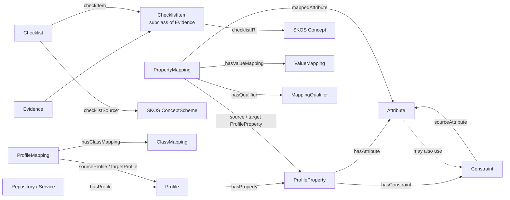

# TRSP architecture diagram

```mermaid
flowchart LR
  R[Repository / Service] -->|hasProfile| P[Profile]
  P -->|hasProperty| PP[ProfileProperty]
  PP -->|hasAttribute| A[Attribute]
  PP -->|hasConstraint| C[Constraint]
  A -. may also use .-> C
  C -->|sourceAttribute| A

  E[Evidence] --> CI[ChecklistItem\nsubclass of Evidence]
  CL[Checklist] -->|checkItem| CI
  CL -->|checklistSource| CS[SKOS ConceptScheme]
  CI -->|checklistIRI| CC[SKOS Concept]

  PM[ProfileMapping] -->|sourceProfile / targetProfile| P
  PM -->|hasClassMapping| CM[ClassMapping]
  PRM[PropertyMapping] -->|source / target ProfileProperty| PP
  PRM -->|mappedAttribute| A
  PRM -->|hasValueMapping| VM[ValueMapping]
  PRM -->|hasQualifier| MQ[MappingQualifier]
```
