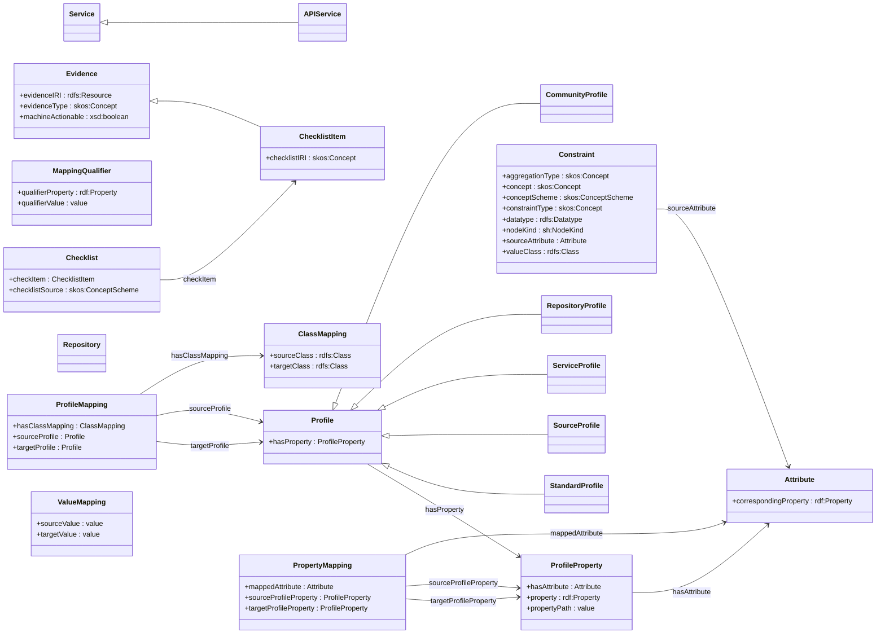

# TRSP detailed class diagram

```mermaid
classDiagram
direction LR
class APIService {
}
class Attribute {
  +correspondingProperty : rdf:Property
}
class Checklist {
  +checkItem : ChecklistItem
  +checklistSource : skos:ConceptScheme
}
class ChecklistItem {
  +checklistIRI : skos:Concept
}
class ClassMapping {
  +sourceClass : rdfs:Class
  +targetClass : rdfs:Class
}
class CommunityProfile {
}
class Constraint {
  +aggregationType : skos:Concept
  +concept : skos:Concept
  +conceptScheme : skos:ConceptScheme
  +constraintType : skos:Concept
  +datatype : rdfs:Datatype
  +nodeKind : sh:NodeKind
  +sourceAttribute : Attribute
  +valueClass : rdfs:Class
}
class Evidence {
  +evidenceIRI : rdfs:Resource
  +evidenceType : skos:Concept
  +machineActionable : xsd:boolean
}
class MappingQualifier {
  +qualifierProperty : rdf:Property
  +qualifierValue : value
}
class Profile {
  +hasProperty : ProfileProperty
}
class ProfileMapping {
  +hasClassMapping : ClassMapping
  +sourceProfile : Profile
  +targetProfile : Profile
}
class ProfileProperty {
  +hasAttribute : Attribute
  +property : rdf:Property
  +propertyPath : value
}
class PropertyMapping {
  +mappedAttribute : Attribute
  +sourceProfileProperty : ProfileProperty
  +targetProfileProperty : ProfileProperty
}
class Repository {
}
class RepositoryProfile {
}
class Service {
}
class ServiceProfile {
}
class SourceProfile {
}
class StandardProfile {
}
class ValueMapping {
  +sourceValue : value
  +targetValue : value
}
Service <|-- APIService
Evidence <|-- ChecklistItem
Profile <|-- CommunityProfile
Profile <|-- RepositoryProfile
Profile <|-- ServiceProfile
Profile <|-- SourceProfile
Profile <|-- StandardProfile
Checklist --> ChecklistItem : checkItem
ProfileProperty --> Attribute : hasAttribute
ProfileMapping --> ClassMapping : hasClassMapping
Profile --> ProfileProperty : hasProperty
PropertyMapping --> Attribute : mappedAttribute
Constraint --> Attribute : sourceAttribute
ProfileMapping --> Profile : sourceProfile
PropertyMapping --> ProfileProperty : sourceProfileProperty
ProfileMapping --> Profile : targetProfile
PropertyMapping --> ProfileProperty : targetProfileProperty

%% Reusable properties with deliberately omitted RDFS domains:
%% correspondingClass -> rdfs:Class
%% hasBenchmark -> unrestricted
%% hasCardinalityType -> skos:Concept
%% hasConstraint -> Constraint
%% hasMeasurementType -> skos:Concept
%% hasProfile -> Profile
%% hasPropertyMapping -> PropertyMapping
%% hasQualifier -> MappingQualifier
%% hasValueMapping -> ValueMapping
%% mappingAlgorithm -> unrestricted
%% mappingType -> skos:Concept
%% sourceConceptScheme -> skos:ConceptScheme
%% targetConceptScheme -> skos:ConceptScheme
```
